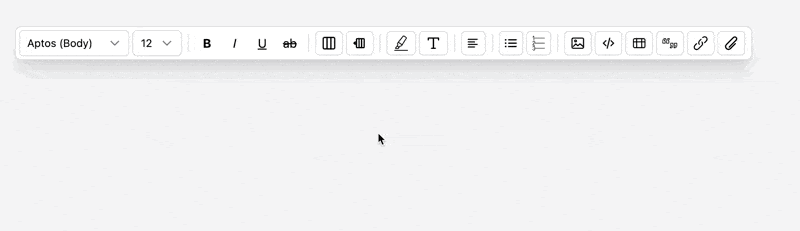

<p align="center">
  <a href="https://github.com/stephen-costa20/rich-text-toolbar"></a>
  <a href="https://github.com/stephen-costa20/rich-text-toolbar/blob/main/LICENSE"></a>
  <a href="https://github.com/stephen-costa20/rich-text-toolbar/commits/main"></a>
  
</p>


# ⭐ EditorEdge - Rich Text Toolbar (Tailwind + Vanilla JS)

A modular, dropdown-based rich text toolbar UI inspired by modern document editors (Word / Google Docs–style), built with **Tailwind CSS** and **plain JavaScript** — no frameworks required.

This project focuses on **UI clarity, interaction design, and accessibility**, rather than editor engine logic.


## Preview




## Overview

This toolbar is designed as a **reusable UI layer** for rich-text or document-style applications. It provides a comprehensive set of formatting controls (font, size, emphasis, color, alignment, lists, media, tables, and code blocks) while remaining:

- Framework-agnostic
- Lightweight
- Easy to integrate into larger systems

The intent is to separate **editor UI** from **editor behavior**, making it suitable for integration with custom editors, contenteditable implementations, or backend-driven document systems.


## Features

- Font family & font size selectors
- Bold, italic, underline, strikethrough
- Highlight & text color pickers (preset + custom)
- Alignment controls (left, center, right, justify)
- Bulleted, dashed, numbered, and alphabetical lists
- Image insertion layout options
- Code block, table, block quote, link, and attachment controls
- Keyboard navigation & focus management
- Accessible ARIA attributes for dropdown menus


## Tech Stack

- **HTML**
- **Tailwind CSS (CDN)**
- **Vanilla JavaScript**

No build tools. No dependencies. Drop-in ready.


## Usage

1. Clone the repository:
   ```bash
   git clone https://github.com/your-username/rich-text-toolbar.git
